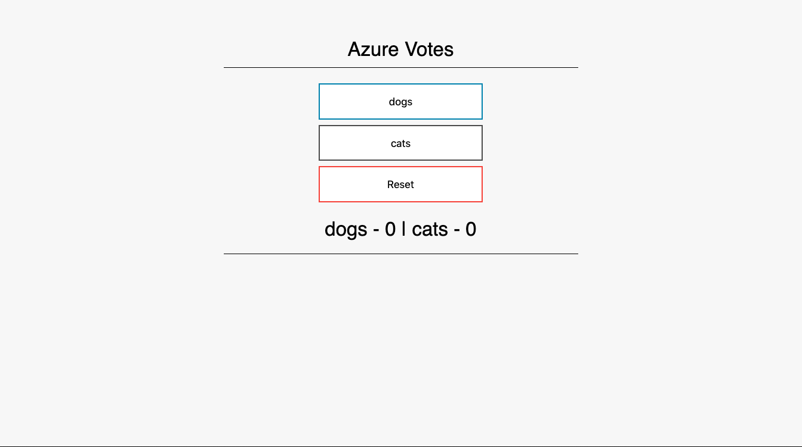

# Azure SQL Votes Demo App

## Build the Docker Image

```
docker build -t your_registry.com/your_org_or_user/sqldemo:1
docker push your_registry.com/your_org_or_user/sqldemo:1
```

## Deploy Demo App

```
helm upgrade --install sqldemo charts/azure-sql-demo \
    --set resourceGroupName=some_resource_group \
    --set serverName=some_name \
    --set databaseName=some_name \
    --set region=westus \
    --set image=your_registry.com/your_org_or_user/sqldemo:1 \
    --set local=true
```

From here you can look at the resources to see when they are done:

```
kubectl get azuresqlfirewallrule
NAME                    PROVISIONED   MESSAGE
saso-sql-fwrule         true          successfully provisioned
saso-sql-fwrule-local   true          successfully provisioned
```

This should only take around 3 minutes to be done.

Now run `kubectl get pods`. You should see the demo deployment in a running state.

```
kubectl get pods
NAME                               READY   STATUS    RESTARTS   AGE
azure-votes-sql-86d66c555b-sjnt2   1/1     Running   4          17m
```

From here you can port-forward to the app and check it out:

```
kubectl port-forward deployment/azure-votes-sql 8080:8080
```

Then visit `http://localhost:8080` in your browser to test.



If you need to access the database via the portal or some SQL workbench tool simply access the secret with the server credentials.

```
kubectl get secret
NAME                            TYPE                                  DATA   AGE
your_sqlserver_name             Opaque                                5      33m
```

The server's admin credentials can be found in this secret. The secret will have the same name as the SQL Server unless a name is provided.